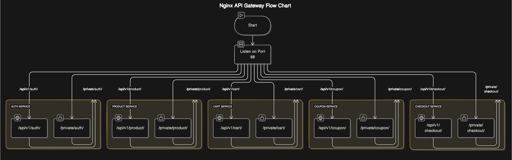

# API Gateway

The API Gateway serves as the entry point for client requests, routing them to the appropriate microservices while also handling authentication, rate limiting, and request logging. This document outlines the structure of the API Gateway and its various features.

## Overview

The API Gateway is responsible for routing incoming HTTP requests to the appropriate microservices based on the requested endpoint. It also enforces authentication, rate limiting, and request logging to ensure security, reliability, and visibility into system interactions.

## High-Level Diagram

## Routes

### Authentication Service

- **Public Endpoints**:
  - `/api/v1/auth/`: Routes to public endpoints of the Authentication Service.
- **Private Endpoints**:
  - `/private/auth/`: Routes to private endpoints of the Authentication Service.

### Product Service

- **Public Endpoints**:
  - `/api/v1/product/`: Routes to public endpoints of the Product Service.
- **Private Endpoints**:
  - `/private/product/`: Routes to private endpoints of the Product Service.

### Cart Service

- **Public Endpoints**:
  - `/api/v1/cart/`: Routes to public endpoints of the Cart Service.
- **Private Endpoints**:
  - `/private/cart/`: Routes to private endpoints of the Cart Service.

### Coupon Service

- **Public Endpoints**:
  - `/api/v1/coupon/`: Routes to public endpoints of the Coupon Service.
- **Private Endpoints**:
  - `/private/coupon/`: Routes to private endpoints of the Coupon Service.

### Checkout Service

- **Public Endpoints**:
  - `/api/v1/checkout/`: Routes to public endpoints of the Checkout Service.
- **Private Endpoints**:
  - `/private/checkout/`: Routes to private endpoints of the Checkout Service.

## Features

- **Authentication**: Ensures that only authenticated users can access private endpoints. Uses JWT tokens for secure authentication.
- **Rate Limiting**: Limits the number of requests per client IP address to prevent abuse or overload of the system.
- **Request Logging**: Logs each incoming request, including details such as timestamp, client IP address, HTTP method, requested URL, and response status code.

## Conclusion

The API Gateway serves as a central hub for managing and routing requests to various microservices in the system. By consolidating these responsibilities, it simplifies the overall architecture while providing essential features for security, reliability, and observability.