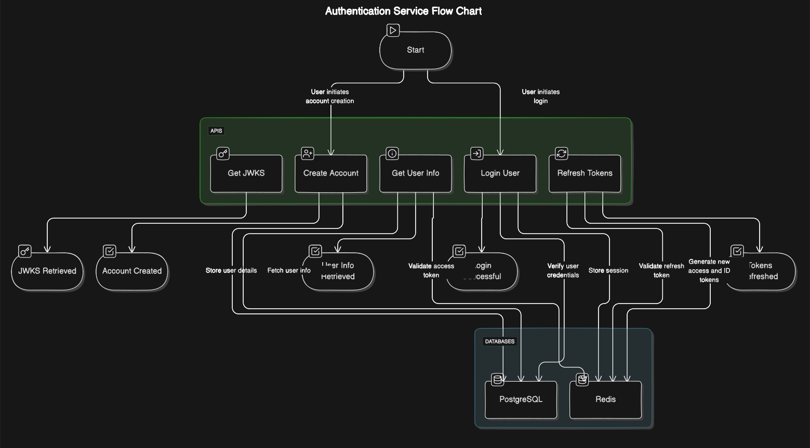

# Authentication Service
This service handles user authentication and session management using PostgreSQL and Redis. PostgreSQL stores user information, while Redis manages sessions.

## Table of Contents
1. [Overview](#overview)
2. [Technologies Used](#technologies-used)
3. [APIs](#apis)
    - [Create Account](#create-account)
    - [Login User](#login-user)
    - [Get User Info from Access Token](#get-user-info-from-access-token)
    - [Get ID Token and Access Token from Refresh Token](#get-id-token-and-access-token-from-refresh-token)
    - [Get JWKS.json Keys](#get-jwksjson-keys)
4. [Database Schema](#database-schema)
    - [PostgreSQL](#postgresql)
    - [Redis](#redis)
5. [Setup](#setup)
6. [Running the Service](#running-the-service)
7. [Diagram](#diagram)


## Overview
This authentication service supports creating user accounts, logging in, managing sessions, and handling JWT tokens. User information is stored in PostgreSQL, while Redis is used for session management.

## Technologies Used
- **PostgreSQL**: For storing user details.
- **Redis**: For managing sessions.
- **Express.js (Node.js)**: Web framework to build APIs.
- **JSON Web Tokens (JWT)**: For secure token generation and validation.

## APIs

### 1. Create Account
**Endpoint**: `/public/create`
**Method**: `POST`
**Description**: Creates a new user account.

#### Request Body
```json
{
  "password": "string",
  "email": "string"
}
```

### 2. Login User
**Endpoint**: `/public/login`
**Method**: `POST`
**Description**: Authenticates a user and returns access and refresh tokens.

#### Request Body
```json
{
  "email": "string",
  "password": "string"
}
```

### 3. Get User Info from Access Token
**Endpoint**: `/public/check`
**Method**: `GET`
**Description**: Retrieves user information based on the access token.

#### Request Headers
```http
Authorization: Bearer <access_token>
```

### 4. Get ID Token and Access Token from Refresh Token
**Endpoint**: `/public/token`
**Method**: `POST`
**Description**: Provides new ID and access tokens using a refresh token.

#### Request Body
```json
{
  "refresh_token": "string"
}
```

### 5. Get JWKS.json Keys
**Endpoint**: `/private/jwks.json`
**Method**: `GET`
**Description**: Retrieves the JSON Web Key Set (JWKS) for token verification.

## Database Schema

### PostgreSQL
- **Users Table**:
  - `id`: UUID, Primary Key
  - `password`: String (hashed)
  - `email`: String, Unique
  - `created_at`: Timestamp

### Redis
- **Sessions**:
  - Stores session tokens and their expiration times.

## Environment Variables:
Create a `.env` file with the following variables:
```sh
POSTGRESQL_URI=your_postgresql_uri
REDIS_URI=your_redis_uri
JWT_SECRET=your_jwt_secret
```


## Diagram

Below is a diagram showing the architecture and flow of the authentication service:



### Diagram Explanation
1. **User Creation**: User sends a request to create an account, data is stored in PostgreSQL.
2. **Login**: User sends login credentials, and tokens are generated and stored in Redis.
3. **Token Management**: Access tokens are used to get user info, and refresh tokens are used to get new tokens.
4. **JWKS**: Public keys for verifying JWTs are provided via an endpoint.


