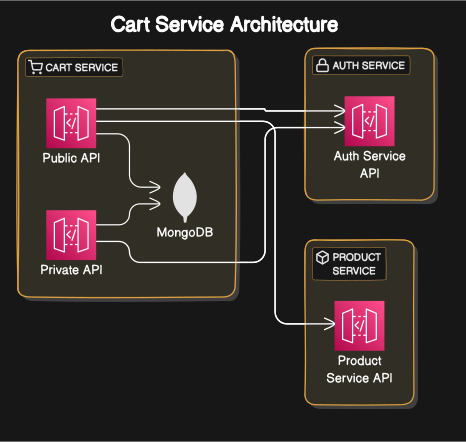

# Cart Service

This service manages cart functionality, including adding, removing, and retrieving items in the cart.

## Table of Contents
1. [Overview](#overview)
2. [Technologies Used](#technologies-used)
3. [APIs](#apis)
    - [Public Routes](#public-routes)
        - [Get Cart Items](#get-cart-items)
        - [Add Item to Cart](#add-item-to-cart)
        - [Remove Item from Cart](#remove-item-from-cart)
    - [Private Routes](#private-routes)
        - [Get User Cart](#get-user-cart)
        - [Empty User Cart](#empty-user-cart)
4. [Database Schema](#database-schema)
    - [MongoDB](#mongodb)
5. [Environment Variables](#environment-variables)

## Overview
The Cart service provides APIs to manage the user's cart, including adding, removing, and emptying cart items. It integrates with the Product service to fetch product details.

## Technologies Used
- **MongoDB**: For storing Cart details.
- **Express.js (Node.js)**: Web framework to build APIs.
- **Prisma**: ORM for PostgreSQL.

## APIs

### Public Routes

#### 1. Get Cart Items
- **Endpoint**: `/public/get`
- **Method**: `GET`
- **Description**: Retrieve all items in the cart for the authenticated user.

#### 2. Add Item to Cart
- **Endpoint**: `/public/add`
- **Method**: `POST`
- **Description**: Add a product to the cart or increase its quantity.

#### 3. Remove Item from Cart
- **Endpoint**: `/public/remove`
- **Method**: `POST`
- **Description**: Remove a product from the cart.

### Private Routes

#### 1. Get User Cart
- **Endpoint**: `/private/get`
- **Method**: `GET`
- **Description**: Retrieve the cart for a specific user without populating product details.

#### 2. Empty User Cart
- **Endpoint**: `/private/empty`
- **Method**: `POST`
- **Description**: Clear the cart for a specific user.

## Database Schema

### MongoDB

#### Cart Collection
- **_id**: String (Primary Key)
- **userId**: String (Unique)
- **items**: Array of Objects
    - **productId**: String
    - **quantity**: Number
    - **createdAt**: DateTime
- **coupon**: String (Optional)
- **createdAt**: DateTime (Default: Current Timestamp)
- **updatedAt**: DateTime (Auto-updated)

### Note:
- The `Cart` collection stores information about user carts.
- Each cart contains the user's ID, items in the cart (with product ID and quantity), optional coupon code, and timestamps for creation and update.
- The `items` field is an array of objects representing products in the cart, with each object containing the product ID, quantity, and creation timestamp.

## Environment Variables
- **DATABASE_URL**: MongoDB connection string.
- **AUTH_SERVICE_URL**: URL to fetch JWKS JSON for JWT verification.
- **PRODUCT_SERVICE_URL**: URL to interact with the Product service.

## Diagram

### Diagram Explanation

1. **Public Routes**:
   - The public routes handle requests that do not require authentication, such as retrieving cart items, adding items to the cart, and removing items from the cart.

2. **Private Routes**:
   - Private routes are accessible only to authenticated users and involve operations like retrieving the user's cart and emptying the cart.

3. **MongoDB Database**:
   - MongoDB is used to store cart data, including user IDs, item details (product ID and quantity), timestamps, and optional coupon codes.

4. **Integration with Auth and Product Services**:
   - The Cart service interacts with the Auth service to verify user authentication and with the Product service to fetch product details for items in the cart.
