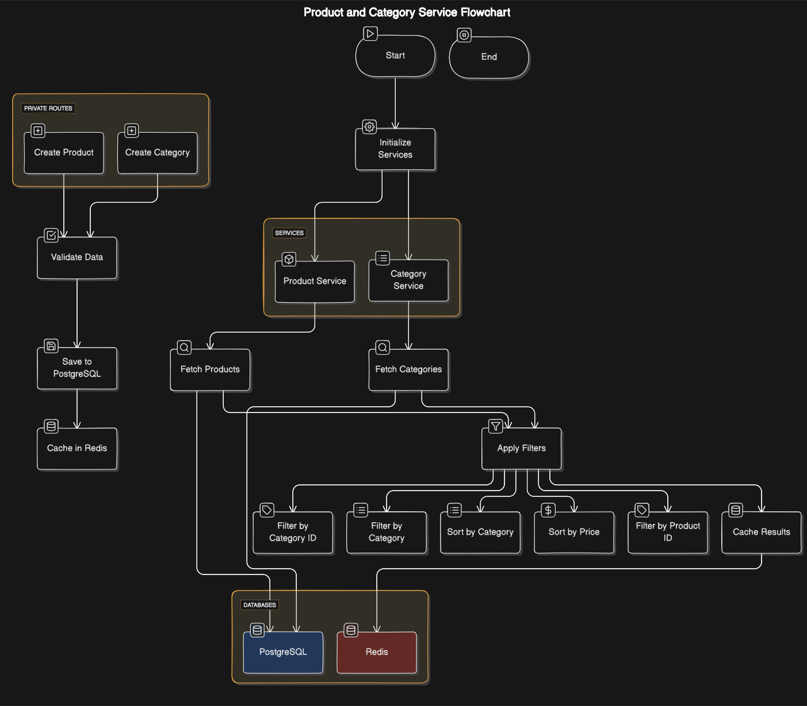

# Product Category Service

This service handles product and category management, including filtering, sorting, and caching using PostgreSQL and Redis.

## Table of Contents
1. [Overview](#overview)
2. [Technologies Used](#technologies-used)
3. [APIs](#apis)
    - [Public Routes](#public-routes)
        - [Get Products](#get-products)
        - [Get Categories](#get-categories)
    - [Private Routes](#private-routes)
        - [Create Product](#create-product)
        - [Create Category](#create-category)
4. [Database Schema](#database-schema)
    - [PostgreSQL](#postgresql)
    - [Redis](#redis)
5. [Environment Variables](#environment-variables)
6. [Diagram](#diagram)

## Overview
This service supports the creation, retrieval, updating, and deletion of products and categories. It also provides filtering and sorting capabilities for products. Redis is used to cache data for improved performance.

## Technologies Used
- **PostgreSQL**: For storing product and category details.
- **Redis**: For caching product and category data.
- **Express.js (Node.js)**: Web framework to build APIs.
- **Prisma**: ORM for PostgreSQL.

## APIs

### Public Routes

#### 1. Get Products
**Endpoint**: `/public/products`
**Method**: `GET`
**Description**: Retrieves a list of products with optional filters and sorting.

##### Query Parameters
- `category`: Filter by category ID
- `sort_by`: Sort by  `name`

#### 2. Get Categories
**Endpoint**: `/public/categories`
**Method**: `GET`
**Description**: Retrieves a list of categories.

### Private Routes

#### 1. Create Product
**Endpoint**: `/private/products`
**Method**: `POST`
**Description**: Creates a new product.

##### Request Body
```json
{
  "name": "string",
  "price": "number",
  "category_id": "string",
  "description": "string"
}
```

#### 2. Create Category
**Endpoint**: `/private/categories`
**Method**: `POST`
**Description**: Creates a new category.

##### Request Body
```json
{
  "name": "string",
  "description": "string"
}
```

## Database Schema

### PostgreSQL
- **Products Table**:
  - `id`: UUID, Primary Key
  - `name`: String
  - `price`: Float
  - `category_id`: UUID, Foreign Key
  - `description`: String
  - `created_at`: Timestamp
  - `updated_at`: Timestamp

- **Categories Table**:
  - `id`: UUID, Primary Key
  - `name`: String
  - `description`: String
  - `created_at`: Timestamp
  - `updated_at`: Timestamp

### Redis
- **Cache**:
  - Caches product and category data to improve performance.

## Environment Variables:
Create a `.env` file with the following variables:
```sh
POSTGRESQL_URI=your_postgresql_uri
REDIS_URI=your_redis_uri
```


## Diagram

Below is a diagram showing the architecture and flow of the product and category service:



### Diagram Explanation
1. **Product and Category Creation**: Private routes are used for creating, updating, and deleting products and categories.
2. **Fetching Data**: Public routes provide access to products and categories with filtering and sorting options.
3. **Caching**: Redis is used to cache frequently accessed data to improve performance.
