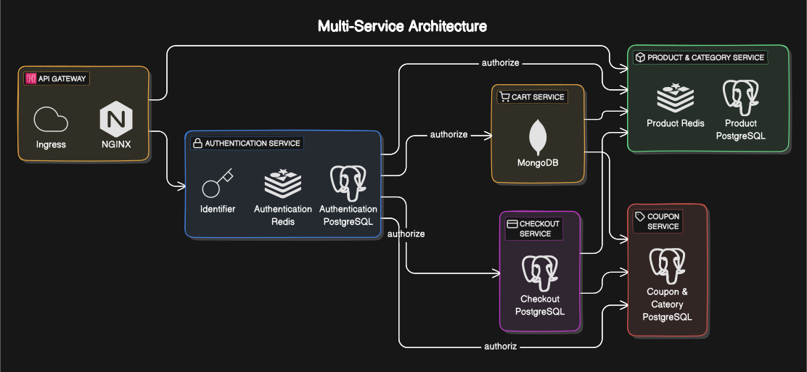

# Multi-Service Architecture

## Overview

This document outlines the architecture for a multi-service system designed to support a comprehensive coupon system. The architecture includes various services such as Authentication, Product & Category Management, Cart, Checkout, and Coupon Management.

## High Level Diagram

## Low Level Diagram

## Task Description

### Building a Coupon System

We aim to develop a versatile coupon system that can accommodate a variety of use cases. The coupon system will support:

1. **Order Number Wise Coupons**: Coupons that are valid for specific order numbers.
2. **Payment Method Wise Coupons**: Coupons applicable based on the payment method used.
3. **Personal Coupons**: Personalized coupons for individual users.
4. **Particular Item Coupons**: Coupons that apply to specific items.
5. **Category Wise Coupons**: Coupons applicable to certain product categories.
6. **Special Day Coupons**: Coupons valid on special days like holidays or anniversaries.
7. **Weekend or Weekday Coupons**: Coupons that are valid only on weekends or weekdays.

### Implementation Plan

1. **Define Coupon Types**: Identify and define the structure for each type of coupon.
2. **Database Schema**: Design the database schema to store coupon information, including associations with orders, payment methods, users, items, and categories.
3. **Coupon Validation Logic**: Implement the logic to validate coupons based on the defined criteria.
4. **API Endpoints**: Create API endpoints for creating, retrieving, updating, and deleting coupons.
5. **Integration with Services**: Integrate the coupon system with the Cart and Checkout services to apply coupons during the purchase process.
6. **Authorization and Authentication**: Ensure that only authorized users can create or modify coupons, and all interactions are authenticated.

### Tools and Technologies

- **Programming Language**: Node.js, Type
- **Databases**: PostgreSQL for relational data, Redis for fast access storage, MongoDB for flexible document storage
- **API Gateway**: Ingress
- **Web Server**: NGINX for handling web traffic
- **Authentication**: JWT tokens for secure authentication

### Conclusion

This architecture is designed to be modular and scalable, ensuring that each service can operate independently while still being able to communicate effectively with other services. The coupon system will be robust and flexible, supporting a wide range of coupon types and ensuring a seamless user experience.